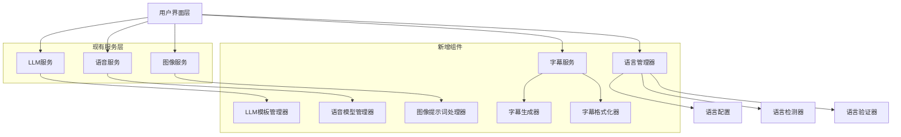

# 设计文档

## 概述

本设计文档描述了如何在现有的AI视频创作工具中实现中英双语视频短片生成功能。该功能将通过扩展现有的服务层、添加语言管理组件、以及增强用户界面来实现，确保用户可以无缝地创建中文或英文视频内容。

## 架构

### 整体架构图



### 核心组件

1. **语言管理器 (LanguageManager)**
   - 管理当前选择的语言
   - 提供语言切换功能
   - 协调各服务的语言设置

2. **双语LLM模板管理器 (BilingualTemplateManager)**
   - 管理中英文提示词模板
   - 根据语言选择合适的模板
   - 支持模板的动态切换
   - 提供中文到英文的翻译模板

3. **语音模型管理器 (VoiceModelManager)**
   - 管理不同语言的语音模型
   - 自动选择合适的音色
   - 处理语音参数的语言特定调整

4. **字幕服务 (SubtitleService)**
   - 生成SRT格式字幕文件
   - 处理字幕时间轴同步
   - 支持不同语言的字体和样式

5. **图像提示词处理器 (ImagePromptProcessor)**
   - 处理中文到英文的提示词转换
   - 优化不同语言的图像描述
   - 确保图像与文本内容的匹配

## 组件和接口

### 1. 语言管理器 (LanguageManager)

```python
class LanguageManager:
    def __init__(self):
        self.current_language: str = "zh-CN"
        self.supported_languages: List[str] = ["zh-CN", "en-US"]
        self.language_configs: Dict[str, LanguageConfig] = {}
    
    def set_language(self, language: str) -> bool
    def get_current_language() -> str
    def get_language_config(self, language: str) -> LanguageConfig
    def is_language_supported(self, language: str) -> bool
    def detect_content_language(self, content: str) -> str
```

### 2. 双语LLM服务扩展 (BilingualLLMService)

```python
class BilingualLLMService(LLMService):
    def __init__(self, api_manager: APIManager, language_manager: LanguageManager):
        super().__init__(api_manager)
        self.language_manager = language_manager
        self.template_manager = BilingualTemplateManager()
    
    async def create_story_bilingual(self, theme: str, language: str) -> ServiceResult
    async def rewrite_text_bilingual(self, text: str, language: str) -> ServiceResult
    async def generate_image_prompts_bilingual(self, text: str, language: str) -> ServiceResult
    async def translate_text(self, text: str, source_language: str, target_language: str) -> ServiceResult
```

### 3. 字幕服务 (SubtitleService)

```python
class SubtitleService:
    def __init__(self, language_manager: LanguageManager):
        self.language_manager = language_manager
        self.subtitle_generator = SubtitleGenerator()
        self.subtitle_formatter = SubtitleFormatter()
    
    def generate_srt_file(self, text_segments: List[TextSegment], audio_timings: List[float]) -> str
    def format_subtitle_for_language(self, subtitle: str, language: str) -> str
    def embed_subtitles_in_video(self, video_path: str, subtitle_path: str, language: str) -> str
    def get_language_specific_fonts(self, language: str) -> List[str]
```

### 4. 语音服务扩展 (BilingualVoiceService)

```python
class BilingualVoiceService(VoiceService):
    def __init__(self, api_manager: APIManager, language_manager: LanguageManager):
        super().__init__(api_manager)
        self.language_manager = language_manager
        self.voice_model_manager = VoiceModelManager()
    
    def get_voices_for_language(self, language: str) -> List[VoiceModel]
    async def text_to_speech_bilingual(self, text: str, language: str) -> ServiceResult
    def get_optimal_voice_settings(self, language: str) -> Dict[str, Any]
```

## 数据模型

### 1. 语言配置模型

```python
@dataclass
class LanguageConfig:
    code: str  # "zh-CN", "en-US"
    name: str  # "中文", "English"
    display_name: str  # "中文 (简体)", "English (US)"
    default_voice: str
    default_font: str
    text_direction: str  # "ltr", "rtl"
    character_encoding: str
    subtitle_settings: SubtitleSettings
```

### 2. 项目语言设置

```python
@dataclass
class ProjectLanguageSettings:
    primary_language: str
    content_language: str
    voice_language: str
    subtitle_language: str
    created_at: datetime
    updated_at: datetime
```

### 3. 字幕配置模型

```python
@dataclass
class SubtitleSettings:
    font_family: str
    font_size: int
    font_color: str
    background_color: str
    position: str  # "bottom", "top", "center"
    line_spacing: float
    max_chars_per_line: int
    word_wrap_style: str  # "character", "word"
```

### 4. 语音模型配置

```python
@dataclass
class VoiceModel:
    id: str
    name: str
    language: str
    gender: str
    style: str
    provider: str
    sample_rate: int
    supported_formats: List[str]
```

## 错误处理

### 1. 语言检测错误
- 当检测到内容语言与选择语言不匹配时，提供用户选择
- 支持混合语言内容的处理
- 提供语言纠正建议

### 2. 语音合成错误
- 当选择语言的语音引擎不可用时，自动降级到备用引擎
- 提供语音质量检测和重新生成选项
- 记录语音生成失败的详细日志

### 3. 字幕生成错误
- 处理字幕时间轴不匹配的情况
- 支持字幕内容的手动调整
- 提供字幕预览和验证功能

### 4. 图像提示词转换错误
- 当中文到英文转换失败时，提供手动编辑选项
- 支持提示词质量评估
- 提供多个转换结果供用户选择

## 测试策略

### 1. 单元测试
- 语言管理器的语言切换功能
- 模板管理器的模板选择逻辑
- 字幕生成器的时间轴计算
- 语音参数的语言特定调整

### 2. 集成测试
- 端到端的双语视频生成流程
- 不同语言间的切换测试
- 多语言项目的保存和加载
- 字幕与语音的同步测试

### 3. 用户界面测试
- 语言选择界面的响应性
- 不同语言下的界面显示
- 错误提示的多语言支持
- 用户操作流程的完整性

### 4. 性能测试
- 大量文本的语言检测性能
- 双语内容生成的响应时间
- 字幕生成和嵌入的效率
- 内存使用情况的监控

## 实现优先级

### 第一阶段：核心双语支持
1. 实现语言管理器
2. 扩展LLM服务支持双语模板
3. 更新用户界面添加语言选择
4. 实现基本的语音语言切换

### 第二阶段：字幕功能
1. 实现字幕服务
2. 添加字幕生成和格式化功能
3. 实现视频字幕嵌入
4. 添加字幕样式自定义

### 第三阶段：高级功能
1. 实现语言质量检测
2. 添加图像提示词智能转换
3. 实现项目语言设置持久化
4. 优化用户体验和错误处理

### 第四阶段：优化和完善
1. 性能优化和缓存机制
2. 添加更多语音引擎支持
3. 实现高级字幕效果
4. 添加批量处理功能