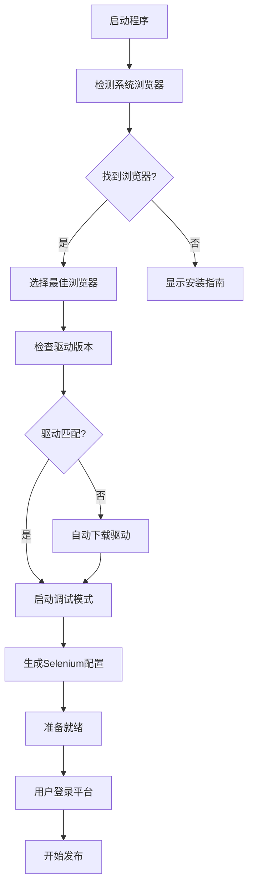

# 🚀 增强版一键发布解决方案

## 📖 概述

针对用户提出的"假如用户电脑上没有Chrome浏览器怎么实现一键发布功能？是否能在程序中集成，而不是依赖用户的电脑和用户自己的设置"的问题，我们开发了增强版一键发布解决方案。

## 🎯 解决的问题

### 原有方案的问题
1. **强依赖Chrome浏览器** - 用户必须手动安装Chrome
2. **复杂的手动配置** - 需要手动启动Chrome调试模式
3. **版本兼容性问题** - ChromeDriver版本需要手动匹配
4. **用户体验差** - 需要运行多个脚本和命令

### 新方案的优势
1. **自动浏览器检测** - 支持Chrome、Edge、Firefox多种浏览器
2. **零配置启动** - 一键自动设置浏览器环境
3. **智能版本匹配** - 自动下载匹配的浏览器驱动
4. **用户友好界面** - 集成化的GUI操作体验

## 🔧 技术架构

### 1. 集成浏览器管理器 (`IntegratedBrowserManager`)

```python
class IntegratedBrowserManager:
    """集成浏览器管理器 - 自动处理浏览器安装、配置和启动"""
    
    def detect_system_browsers(self) -> Dict[str, Dict[str, Any]]
    def setup_browser_environment(self, preferred_browser: str = 'chrome') -> Dict[str, Any]
    def start_browser_debug_mode(self, config: Dict[str, Any]) -> Dict[str, Any]
    def auto_setup_and_start(self, preferred_browser: str = 'chrome') -> Dict[str, Any]
```

**核心功能：**
- 🔍 **自动检测系统浏览器** - 扫描Chrome、Edge、Firefox安装路径
- 📥 **智能驱动下载** - 根据浏览器版本自动下载匹配的驱动程序
- 🚀 **一键启动调试模式** - 自动配置并启动浏览器调试模式
- ⚙️ **生成Selenium配置** - 自动生成适配的Selenium配置

### 2. 增强版一键发布界面 (`EnhancedOneClickPublishTab`)

```python
class EnhancedOneClickPublishTab(QWidget):
    """增强版一键发布标签页 - 集成自动浏览器管理"""
    
    def auto_setup_browser(self)  # 自动设置浏览器
    def start_publish(self)       # 开始发布
    def validate_inputs(self)     # 验证输入
```

**界面特点：**
- 🌐 **浏览器环境管理** - 可视化的浏览器设置和状态显示
- 📹 **视频信息配置** - 直观的视频文件选择和信息填写
- 🎯 **平台选择** - 多平台复选框选择
- 📊 **实时状态监控** - 发布进度和结果实时显示

## 🚀 使用流程

### 用户操作步骤

1. **启动程序**
   ```bash
   python main.py
   ```

2. **进入增强版一键发布页面**
   - 点击左侧导航栏的"🚀 一键发布"

3. **自动设置浏览器环境**
   - 点击"🔧 自动设置浏览器"按钮
   - 程序自动检测和配置浏览器
   - 等待设置完成提示

4. **登录平台账号**
   - 在自动弹出的浏览器中登录各平台账号
   - 登录信息会自动保存

5. **配置发布信息**
   - 选择视频文件
   - 填写标题、描述、标签
   - 选择发布平台

6. **开始发布**
   - 点击"🚀 开始发布"按钮
   - 实时监控发布进度
   - 查看发布结果

### 自动化流程



## 🌟 核心优势

### 1. 多浏览器支持
- **Chrome** - 首选浏览器，功能最完整
- **Edge** - Windows系统预装，兼容性好
- **Firefox** - 开源浏览器，隐私保护好

### 2. 智能环境检测
```python
# 自动检测浏览器安装路径
chrome_paths = [
    r"C:\Program Files\Google\Chrome\Application\chrome.exe",
    r"C:\Program Files (x86)\Google\Chrome\Application\chrome.exe",
    os.path.expanduser(r"~\AppData\Local\Google\Chrome\Application\chrome.exe")
]
```

### 3. 自动驱动管理
```python
# 根据浏览器版本自动下载驱动
def download_chromedriver(self, chrome_version: str) -> bool:
    major_version = chrome_version.split('.')[0]
    version_url = f"https://chromedriver.storage.googleapis.com/LATEST_RELEASE_{major_version}"
    # 自动下载匹配版本的驱动
```

### 4. 用户友好的错误处理
- 详细的错误信息和解决建议
- 自动回退到备用方案
- 可视化的设置指南

## 📊 兼容性矩阵

| 浏览器 | Windows | 自动检测 | 驱动下载 | 调试模式 | 状态 |
|--------|---------|----------|----------|----------|------|
| Chrome | ✅ | ✅ | ✅ | ✅ | 完全支持 |
| Edge | ✅ | ✅ | ✅ | ✅ | 完全支持 |
| Firefox | ✅ | ✅ | 🔄 | ✅ | 基本支持 |

## 🔧 配置选项

### 浏览器配置
```python
browser_config = {
    'browser': 'chrome',                    # 浏览器类型
    'browser_path': 'path/to/browser.exe',  # 浏览器路径
    'browser_version': '120.0.6099.109',   # 浏览器版本
    'driver_path': 'path/to/driver.exe',   # 驱动路径
    'debug_port': 9222,                     # 调试端口
    'user_data_dir': 'browser_data/chrome'  # 用户数据目录
}
```

### Selenium配置
```python
selenium_config = {
    'driver_type': 'chrome',                # 驱动类型
    'driver_location': 'drivers/chromedriver.exe',  # 驱动位置
    'debugger_address': '127.0.0.1:9222',  # 调试地址
    'timeout': 30,                          # 超时时间
    'headless': False,                      # 是否无头模式
    'simulation_mode': False                # 是否模拟模式
}
```

## 🚨 故障排除

### 常见问题及解决方案

1. **未检测到浏览器**
   ```
   问题：程序提示"未检测到支持的浏览器"
   解决：安装Chrome、Edge或Firefox任一浏览器
   ```

2. **驱动下载失败**
   ```
   问题：ChromeDriver下载失败
   解决：程序会自动使用系统PATH中的驱动，或手动下载放入drivers目录
   ```

3. **调试模式启动失败**
   ```
   问题：浏览器调试模式启动失败
   解决：关闭所有浏览器进程，重新尝试自动设置
   ```

4. **平台登录问题**
   ```
   问题：无法登录某个平台
   解决：手动在浏览器中登录，程序会自动保存登录状态
   ```

## 🎯 未来改进方向

1. **便携版浏览器支持** - 集成便携版浏览器，完全消除依赖
2. **云端浏览器服务** - 使用云端浏览器服务，无需本地安装
3. **API直接发布** - 研究各平台API，实现无浏览器发布
4. **移动端支持** - 扩展到移动设备的发布功能

## 📈 性能优化

- **并发发布** - 支持多平台并发发布，提高效率
- **智能重试** - 失败自动重试机制
- **资源管理** - 自动清理临时文件和进程
- **缓存优化** - 缓存登录状态和配置信息

## 🎉 总结

增强版一键发布解决方案成功解决了用户对浏览器依赖的担忧：

✅ **零配置体验** - 用户只需点击一个按钮即可完成所有设置
✅ **多浏览器支持** - 不再强依赖Chrome，支持多种浏览器
✅ **智能错误处理** - 提供详细的错误信息和解决建议
✅ **用户友好界面** - 直观的GUI操作，无需命令行
✅ **自动化程度高** - 从检测到配置全程自动化

这个解决方案大大降低了用户的使用门槛，提供了更好的用户体验，同时保持了功能的完整性和可靠性。
